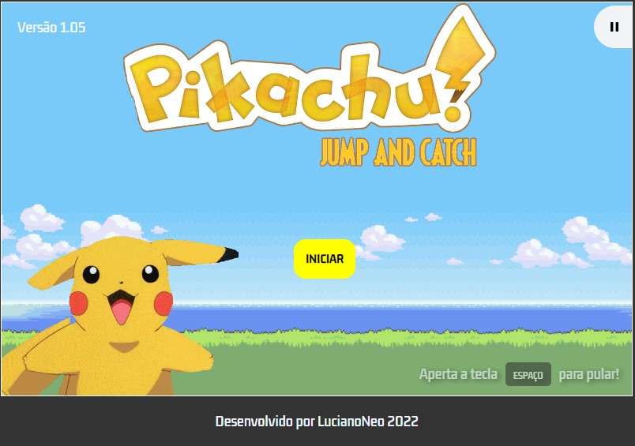
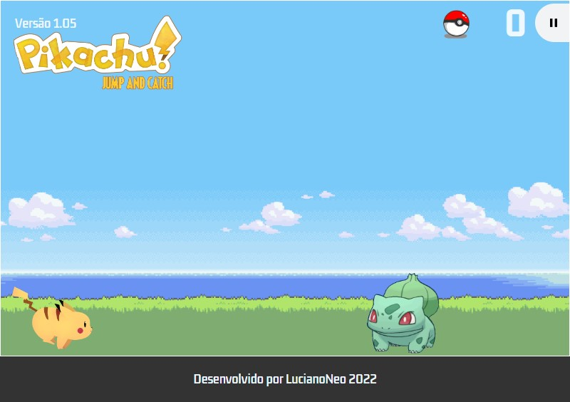
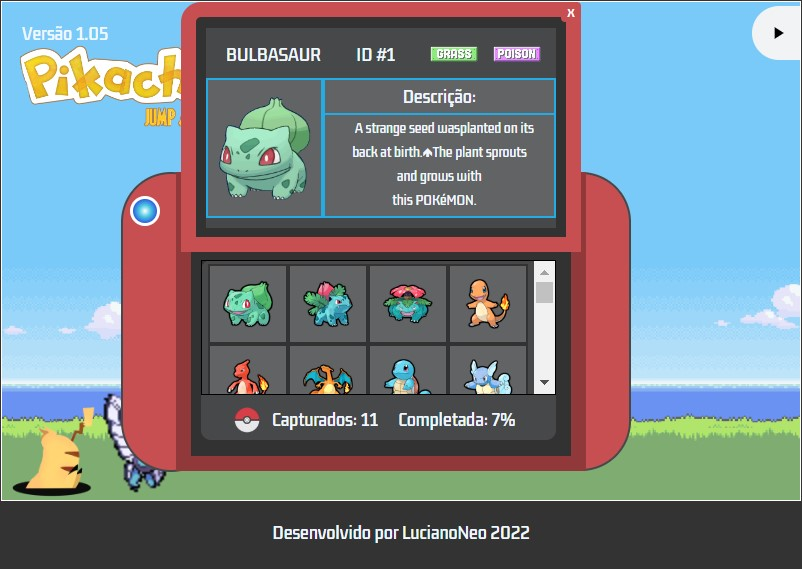
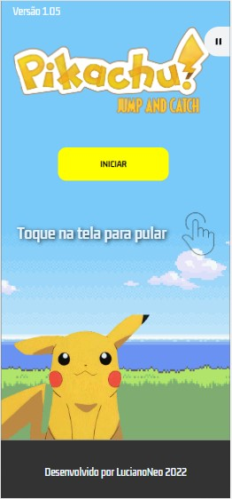
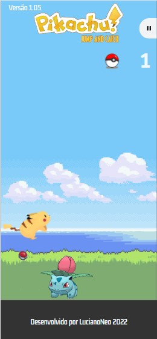
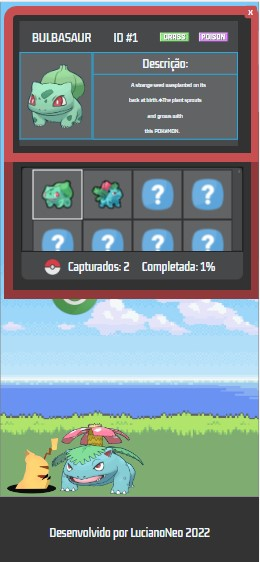

# Pikachu-Jump
Pikachu Jump é o primeiro jogo que desenvolvo utilizando os conhecimentos que venho estudando na área de Front-End. 
- O jogo está sendo desenvolvido com HTML5, CSS3 e JavaScript.
- O jogo tem como objetivo saltar sobre os pokémon para assim capturá-los e adicioná-los à Pokedex.
DESKTOP:

MOBILE:

 
## Objetivos concluídos na VERSÃO 1.0 ✅
- Adição da primeira geração de pokémon (1 ao 151)
- Mecânica de pulo utilizando animações em CSS e evento escutador em Javascript
- Colisão que causa game Over 
- Efeitos sonoros adicionados
- Trilha sonora adicionada
- Aumento de dificuldade/velocidade quanto maior for o número de capturas
- Mostrar a pokédex ao término do jogo, mostrando quais pokémon foram capturados pelo jogador
- Pokedéx desenhada completamente com CSS
- Utilização de API para alimentar as informações da pokedex
- Final de jogo/créditos animado com CSS + JS
- Responsividade para os principais mobiles

## Objetivos para a versão 2.0: 🧹
- Sistema de rank
- Compartilhamento de resultados nas redes sociais
- Sistema de power-ups
- Adequação do tamanho dos pokémon

JOGUE AQUI => https://lucianoneo.github.io/pikachu-jump/

